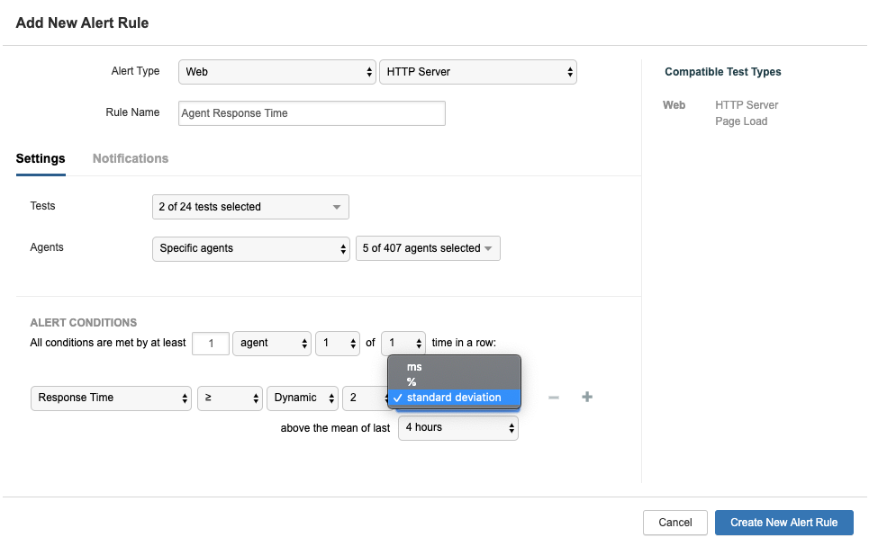

# Dynamic Baselines

Dynamic baselines allow users to create alerts that more accurately reflect the natural variance in test data. Using standard deviation, percentage change, or absolute values, users can configure alerts that dynamically determine whether to fire or not, based on historical data within a sliding time window.


Dynamic baselines are currently only available for Cloud and Enterprise Agent alerts.


* The standard deviation \(STDEV\) for these results is 36. Using the default multiplier, the alert would fire if the next test returned a response time greater than 500+\(36x2\) = 572ms.
* The percentage change would need to be at least 10% to have avoided firing until now. With an average of 500ms, the alert would now fire if the next test returned a response time greater than 500+10% = 550ms.
* The absolute value needs to be at least 50ms for the alert to have not fired \(the third value, 550, is 50 more than the average of the first two test results\). The alert would therefore only fire if the next test returned a response time of 500+50 = 550ms.

In this example, alert rules using both the percentage change and absolute values would fire at the same point \(551ms or longer\), while alert rules using standard deviation would not fire until 573ms.

Now let’s add two more results - 482ms and 464ms. All six results are within the two hour window, which changes the average or baseline to 491ms, as well as changing when the alert fires:

* The STDEV for the six results is 32.5, meaning that the alert would fire if the next test response time was greater than 491+\(32.5\*2\) = 556ms.
* The percentage change remains 10%, meaning that the alert would fire if the next test response time was greater than 491+10% = 540ms.
* The absolute value remains 50ms, meaning that the alert would fire if the next test response time was greater than 491+50 = 541ms.

The different options allow users to adapt their alerting framework to better reflect the fluctuation in test results, and ensure that their system isn’t overwhelmed with alerts because of static metric baselines.

The following metrics currently support dynamic baselines:

* Web / HTTP server / Response Time
* Web / Page Load / Page Load Time
* Network / End to End \(Server\) / Latency

The image below shows an example alert configuration using a dynamic baseline. The alert condition states that if the response time exceeds two standard deviations above the average value over the last four hours, the alert will fire.


The time window for the alert must be at least three times the length of the interval of any tests it is attached to, in order to fire. For example, if a test runs every five minutes, the time window for the alert must be at least fifteen minutes in order to gather the three data points required.


