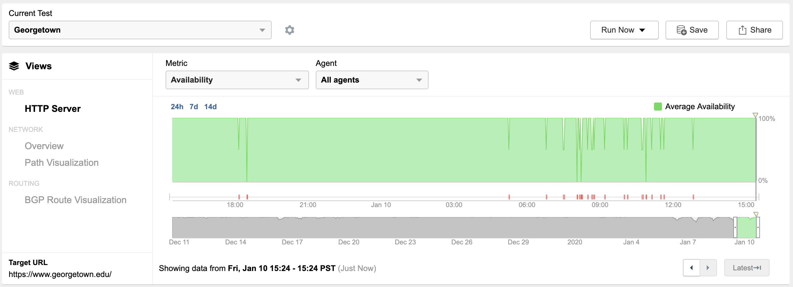
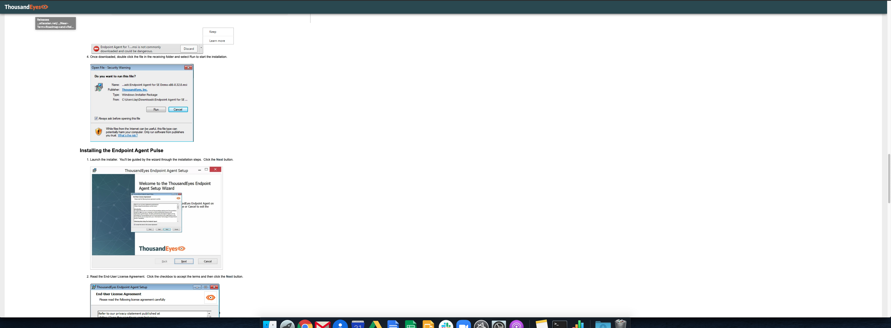

# Markdown Formatting Guide

## Heading One

### Heading Two

#### Heading Three

This sentence about formatting is important, as are these bullet points:

* This sentence uses **bold**.
* This one uses _italics_.
* It is unlikely that we will need ~~strikethrough text~~.
* This is an `inline code reference`.
* This is a link to [another doc](sandbox/test.md).
* This is a link to [another website](https://www.google.com).

🛑 Do not put emojis in documentation.

$$formula = 5+66/76(13^7)$$ 

Here is some more text, that has an image  inline.

* This bullet is at the first level.
  * This is the second level.
* This is the first level again.
  * Again, the second.
    * This is the third level.
      * This is the fourth level.
        * Fifth.
          * Sixth.
            * Seventh.
              * Eighth
                * Ninth
                  * Tenth
                    * This is excessive, but eleventh.
                      * Twelfth
                        * Thirteenth
                          * Fourteenth
                            * I can't imagine we go down fifteen levels, but now we know we can.
* [ ] Here are some tasks in a checklist.
* [ ] Here is another task.
* [ ] Best of luck.

1. This is an ordered list.
   1. This is step 1a.
      1. This is step 1aa
      2. This is step 1ab
   2. This is step 1b
2. This is step two.
   1. You can't have bullets inside an ordered list, though we should test this from GitHub -&gt; GitBook as well.



```cpp
This is a block of code. I can change the programming language if I want.
```



```bash
Here is another tab
```



```css
Here is another tab
```



> This is a quote.
>
> There are two paragraphs in it.



| This table | Contents |
| :--- | :--- |
| Here is line one | Here is line two, with some more content. |
| There is another row here | It autodetermines the best place for the middle line of the two columns, and will auto wrap when necessary. |


This is an information bubble.



This is a caution or warning.



This is definitely a warning.



This is a checkmark to confirm something works.




API Method



This is an example of the markdown.






This is a string.










```
Woo it worked.
```







Here are some random tabs in case you have different versions of a thing.



Here is the second tab.

It doesn't have as much content.

$$
a = b
$$



$$
a = b
$$


